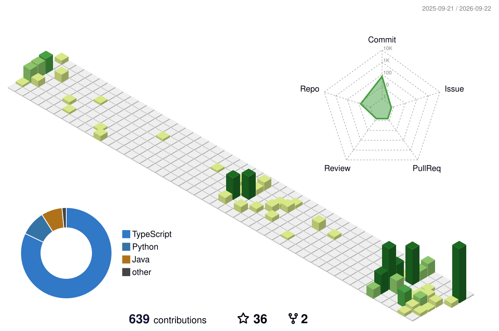
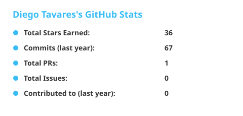

# Hi, I'm Diego Tavares 👋

### Front-end Developer · Computer Science Student

Curious about how things work. Passionate about bringing ideas to the web.

  
  
  

[About me](#about-me) · [Tech stack](#tech-stack) · [Toolbox](#toolbox) · [GitHub activity](#github-activity)

---

## About me

My interest in development started with a simple question: **how are games, apps, and websites built?** That curiosity led me to Computer Science and front-end development.

I enjoy turning ideas into interfaces, exploring new tools, and learning through hands-on projects. I'm always open to challenges that help me grow as a developer and collaborate with others.

- 💻 My focus is **front-end development**, with an interest in web and mobile applications.
- 🌱 I'm building **personal projects** to deepen my knowledge and explore new technologies.
- 🎮 Games, technology, and innovation keep me curious beyond the code.

## Tech stack

### Languages & foundations

### Web & mobile

## Toolbox

## GitHub activity

### Contribution playground

  <picture>
    <source media="(prefers-color-scheme: dark)" srcset="./assets/github-snake-dark.svg" />
    
  </picture>

  
<strong>Explore my contributions in 3D</strong>

   
  <picture>
    <source media="(prefers-color-scheme: dark)" srcset="./profile-3d-contrib/profile-night-view.svg" />
    
  </picture>

### Recent activity

<!--START_SECTION:activity-->
See my latest public activity on [GitHub](https://github.com/CodaxiKing).
<!--END_SECTION:activity-->

  
  
<a href="https://github.com/CodaxiKing?tab=repositories">Explore my repositories →</a>

---

  <strong>Let's connect.</strong> 
  Have a project in mind or want to exchange ideas? 
  <a href="mailto:diegomelo437@gmail.com">Send me an email</a> or <a href="https://linkedin.com/in/diego-tavares-melo">find me on LinkedIn</a>.

